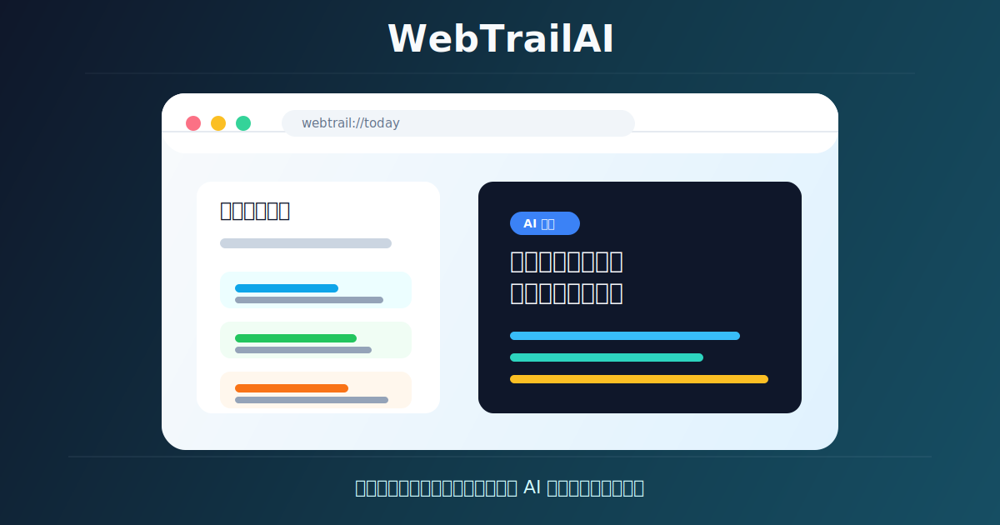
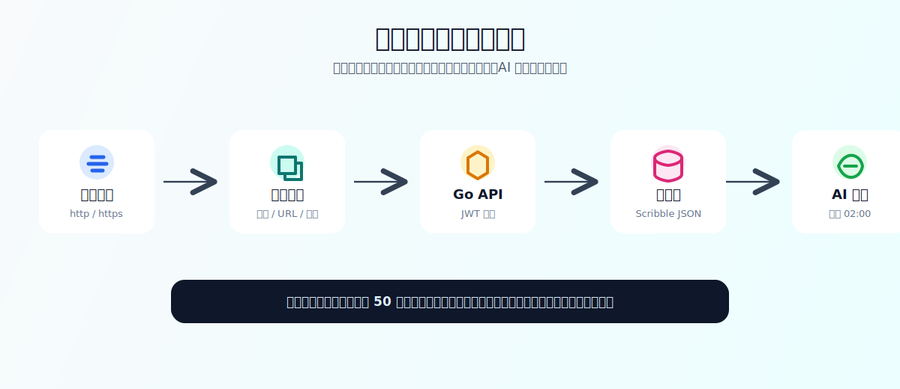
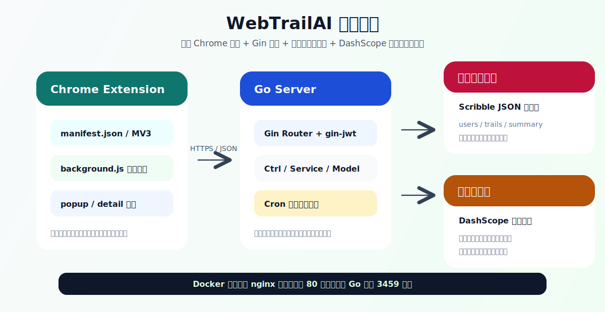

# WebTrailAI

> 记录每天浏览过的网页，第二天由 AI 帮你复盘昨天的信息摄入、工作线索和注意力流向。



WebTrailAI 是一个面向个人自部署的浏览器插件开源项目。插件会在你登录后自动记录当天访问过的网页标题与 URL，并把网页正文文本同步到后端。配置 AI Key 后，后端每天定时读取前一天的浏览轨迹，调用大模型生成一份中文总结，让你用更低成本回看自己昨天到底在研究什么、消耗什么、推进什么。

## 功能特性

- **自动记录浏览轨迹**：基于 Chrome Extension Manifest V3，支持普通页面加载和 SPA 路由变化采集。
- **登录后才开始记录**：内置注册、登录、刷新 Token 与退出登录流程。
- **账号隔离本地历史**：插件弹窗只展示当前账号当天最近 50 条浏览记录。
- **后端按日期归档**：Go 后端按用户和日期保存浏览记录，便于生成每日总结。
- **AI 每日复盘**：默认每天凌晨 2 点生成昨日总结，支持分片总结后再合成最终报告。
- **总结列表与详情页**：插件内可查看每日总结列表，并打开详情页阅读完整内容。
- **轻量自部署**：后端使用 Gin + Scribble 文件数据库，Docker 镜像内置 nginx 反向代理。

## 效果与流程



浏览时，插件会采集页面标题、URL 和正文文本。标题与 URL 会进入插件本地今日列表，正文文本只用于同步到后端和 AI 总结，不写入插件本地历史。

后端会过滤无效或低价值记录，例如过短标题、重复标题、非法 URL，并限制单日记录数量，避免日志无限增长。

## 技术架构



| 模块 | 技术栈 | 说明 |
| --- | --- | --- |
| 浏览器插件 | Chrome Extension MV3、原生 HTML/CSS/JavaScript、jQuery | 负责登录、采集、弹窗展示、总结详情 |
| 后端服务 | Go 1.24、Gin、gin-jwt、Viper、Zap | 负责鉴权、接口、定时任务、日志和配置 |
| 本地存储 | Scribble JSON 文件数据库 | 保存用户、浏览记录和每日总结 |
| AI 能力 | DashScope 兼容 OpenAI 风格接口 | 默认配置为阿里云 DashScope 兼容模式 |
| 容器部署 | Docker、nginx、Alpine | nginx 监听 80 端口并转发到 Go 服务 3459 端口 |

## 目录结构

```text
.
├── extension/              # 浏览器插件前端
│   ├── manifest.json       # 插件声明和权限
│   ├── background.js       # 后台采集与上报
│   ├── contentScript.js    # 页面标题、URL、正文采集
│   ├── popup.html          # 插件弹窗
│   ├── popup.js            # 弹窗交互和总结展示
│   └── trail.css           # 插件样式
├── server/                 # Go 后端服务
│   ├── cmd/                # 服务入口
│   ├── internal/router/    # 路由和 JWT 中间件
│   ├── internal/ctrl/      # HTTP 控制层
│   ├── internal/service/   # 业务逻辑和每日总结任务
│   ├── internal/model/     # 请求、响应和文件库模型
│   └── pkg/                # 工具封装
├── deploy/                 # Docker、nginx 和配置模板
└── doc/                    # README 配图
```

## 快速开始

### 1. 启动后端

如果本地还没有 `server/config.yaml`，可以先复制配置模板：

```bash
cp deploy/config.yaml.template server/config.yaml
```

然后编辑 `server/config.yaml`，至少填写 JWT 密钥：

```yaml
secret: "请替换为足够随机的字符串"
```

如果需要 AI 总结，再填写 DashScope API Key：

```yaml
ai:
  dashscope_api_key: "你的 DashScope API Key"
  base-url: "https://dashscope.aliyuncs.com/compatible-mode/v1"
  model: "qwen3.6-plus"
```

启动服务：

```bash
cd server
go run ./cmd --conf ./config.yaml
```

默认后端监听 `http://127.0.0.1:3459`。

### 2. 配置插件后端地址

插件默认请求地址在 `extension/auth.js`：

```js
var API_BASE_URL = 'https://webtrail.zmz8.com/';
```

本地调试或自部署时，把它改成你的后端地址，例如：

```js
var API_BASE_URL = 'http://127.0.0.1:3459/';
```

### 3. 加载浏览器插件

1. 打开 Chrome 或兼容浏览器的扩展管理页：`chrome://extensions`
2. 开启“开发者模式”
3. 选择“加载已解压的扩展程序”
4. 选择项目里的 `extension/` 目录
5. 打开插件弹窗，注册或登录账号后开始记录

当前插件是原生前端项目，没有 `package.json`，不需要构建步骤。

## Docker 部署

构建镜像：

```bash
docker build -f deploy/Dockerfile -t webtrailai:latest .
```

如果需要指定 Linux AMD64 平台：

```bash
docker build \
  --platform linux/amd64 \
  -f deploy/Dockerfile \
  -t webtrailai:latest \
  .
```

启动容器：

```bash
docker run -d --name webtrailai \
  -p 3459:80 \
  -e WEBTRAIL_SECRET='请替换为足够随机的字符串' \
  -e WEBTRAIL_AI_DASHSCOPE_API_KEY='你的 DashScope API Key' \
  -v /root/config:/opt/webtrailai/config \
  -v /root/filedb:/opt/webtrailai/server/filedb \
  -v /root/logs:/opt/webtrailai/server/logs \
  webtrailai:latest
```

首次启动时，如果宿主机 `/root/config` 目录里没有 `config.yaml`，容器会根据镜像内的脱敏模板自动初始化。后续修改宿主机上的 `config.yaml` 并重启容器即可生效。

常用环境变量：

| 环境变量 | 对应配置 | 说明 |
| --- | --- | --- |
| `WEBTRAIL_SECRET` | `secret` | JWT 签名密钥，生产环境必须配置 |
| `WEBTRAIL_AI_DASHSCOPE_API_KEY` | `ai.dashscope_api_key` | DashScope API Key |
| `WEBTRAIL_CONFIG_PATH` | 配置文件路径 | 容器内默认 `/opt/webtrailai/config/config.yaml` |

## 配置说明

核心配置见 `deploy/config.yaml.template`：

```yaml
gin:
  port: 3459

db:
  filedir: "/opt/webtrailai/server/filedb"

summary:
  enabled: true
  cron: "0 2 * * *"
  debug-enabled: false
```

`summary.cron` 使用标准 5 段 cron 表达式，默认每天凌晨 2 点生成前一天全部账号的浏览总结。

如果启用调试接口，可通过下面的接口手动触发一次昨日总结：

```text
GET /debug/summary?action=run_yesterday_summary&token=你的调试 token
```

生产环境请保持 `summary.debug-enabled: false`，或使用足够随机的调试 token。

## API 概览

| 方法 | 路径 | 是否需要登录 | 用途 |
| --- | --- | --- | --- |
| `POST` | `/register` | 否 | 注册用户 |
| `POST` | `/login` | 否 | 登录并获取 Token |
| `POST` | `/refresh_token` | 否 | 刷新 Token |
| `POST` | `/logout` | 否 | 退出登录 |
| `POST` | `/api/trailAdd` | 是 | 新增浏览记录 |
| `POST` | `/api/cleanTodayTrail` | 是 | 清空今日浏览记录 |
| `GET` | `/api/summaryList` | 是 | 获取最近每日总结列表 |
| `GET` | `/api/summaryDetail?date=YYYYMMDD` | 是 | 获取指定日期总结详情 |

## 隐私与安全提示

浏览历史属于高度敏感数据，建议优先自部署，并把服务放在可信网络或 HTTPS 域名后。

当前实现会把网页标题、URL 和截断后的正文文本发送到你配置的后端，用于后续 AI 总结。插件本地只保留标题、URL 和访问时间，不保留正文。

当前用户密码以明文形式保存在本地文件数据库中，项目更适合作为个人自托管工具使用。如果要开放给多人或公网长期使用，建议先补充密码哈希、HTTPS、访问限流、审计日志和数据备份策略。

## 开发与测试

后端测试：

```bash
cd server
go test ./...
```

后端启动：

```bash
cd server
go run ./cmd --conf ./config.yaml
```

插件验证以浏览器手工测试为主：

- 改 `popup.*` 后，重新加载插件并确认弹窗能正常打开。
- 改 `background.js` 或 `contentScript.js` 后，访问普通 `http/https` 页面并检查是否能记录。
- 改 `manifest.json` 后，确认扩展能成功加载且权限没有报错。

## 参考

- 文件数据库使用 [scribble](https://github.com/sdomino/scribble)
- 后端 Web 框架使用 [Gin](https://github.com/gin-gonic/gin)
- JWT 中间件使用 [gin-jwt](https://github.com/appleboy/gin-jwt)
